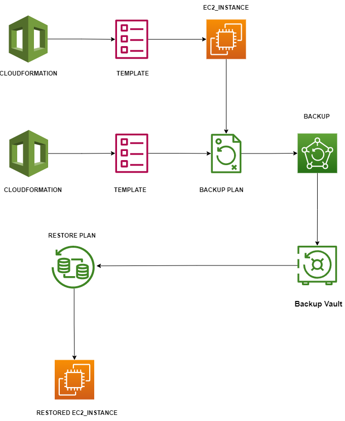

 # EC2_BACKUP CREATION USING BACKUP PLAN(CLOUDFORMATION SERVICE)
Use sample AWS CloudFormation templates to learn how to declare specific AWS resources or solve a particular use case. We recommend that you use sample templates as a starting point for creating your own templates, not for launching production-level environments. Before launching a template, always review the resources that it will create and the permissions it requires.

## About the Repository
maintain sample templates in the `tharun4153/ec2backup ` folder. 

## Submitting Templates
Before you submit a template, we suggest that you follow these guidelines to help maintain consistency between templates.

- Test your template. Can you successfully create a stack with it? When you create a stack, AWS CloudFormation uses the `ValidateTemplate` API to check your template. When you delete a stack, is the stack (and all of its resources) successfully deleted? Make sure users aren't left with stray resources or stacks that have deletion errors.
- In the Description section, add a brief description of your template. The description should indicate what the template does and why it's useful. For example:
	Here we create a EC2 Backup template using cloud formation.Here we can add the some custom policies and custom roles.

- Format your template to make it human readable:
	- Err on the side of human readability. If it makes your template easier to read, do it.
	- Use a linter. There isn't one specific tool that we use. Whatever you use, make sure it also checks for syntax errors.
	- Consider using two-space indents to reduce line wrapping.
- Review IAM resources. If you include IAM resources, follow the standard security advice of granting least privilege (granting only the permissions required to do a task).

When your template is ready, submit a pull request. A member of the AWS organization will review your request and might suggest changes. We review templates to check for general security issues, but we won't test or maintain them. If we don't get back to you within a week of your submission, use your pull request to send us a message.

## Additional Resources
In the *AWS CloudFormation User Guide*, you can view more information about the following topics:

- I add all custom policies in repository

- you need to update your policies

- I uploaded some screenshots  'Images folder'

- Here I created the custom roles and add some AWS Managed Policies and custom policies

- Here I created custom Policies called restore and add to my role

- Here Trust Relations also Important for backup the Resourses

- Here EC2 Instance created using CLOUDFORMATION the Script be added in Repository

- Here we created backup plan to backup the Ec2 instance the script added in Repository.

  
- WHAT WE CREATED SHOULD BE IN ARCHITECTURE FORMATE

- Learn how to use templates to create AWS CloudFormation stacks using the [AWS Management Console](http://docs.aws.amazon.com/AWSCloudFormation/latest/UserGuide/cfn-console-create-stack.html) or [AWS Command Line Interface (AWS CLI)](http://docs.aws.amazon.com/AWSCloudFormation/latest/UserGuide/using-cfn-cli-creating-stack.html).
- To view all the supported AWS resources and their properties, see the [Template Reference](http://docs.aws.amazon.com/AWSCloudFormation/latest/UserGuide/template-reference.html).

